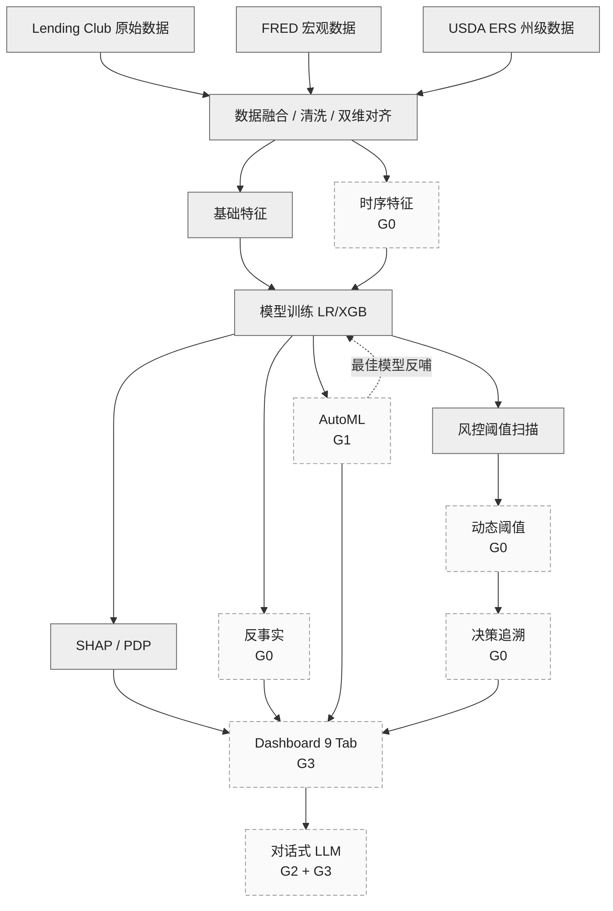

# 项目执行路线

> 清华大学 AI 数据基础课程大作业 · 个人贷款违约风险检测
> 两人组：xwp（数据 / 建模 / 工程）+ zyf（时序 / 因果 / 决策）

---

## 一、现状

中期评分 14/20。已有的能力清单：

| 已建好 | 状态 |
|---|---|
| 三类数据融合（Lending Club / FRED / ERS） | ✅ 跑通 |
| 基础特征 + LR/XGBoost baseline（AUC 0.71） | ✅ 跑通 |
| SHAP + PDP 可解释性 | ✅ 跑通 |
| 风控阈值扫描 | ✅ 跑通 |
| 13 张进阶可视化（地图 / 热力图 / 雷达 / 多曲线对比） | ✅ 跑通 |
| Streamlit Dashboard 5 Tab + 静态展示 | ✅ 跑通 |
| LLM 自动报告 + 命令行 NL 问答（Text-to-Pandas） | ✅ 跑通 |
| zyf 的时序特征 / 因果 / 动态阈值 / 决策追溯（4 个新脚本） | ⚠️ 代码合并未跑通 |

---

## 二、目标

老师反馈明确要求三件能拉分的事：

- T1：**交互式可视化系统**——Dashboard 不能是静态图册，必须有筛选、滑块、参数化
- T2：**自然语言接口 + LLM 自动可视化**——NL 问答要进 Dashboard，且 LLM 要能自动出图
- T3：**数据驱动 AutoML**——模型不能只手工调，要有自动选模型、选特征、调超参

---

## 三、Gap 分析

已有 → 目标 之间，差 4 个 Gap。每个 Gap 都是一个独立可交付的工作包：

| Gap | 名称 | 缺什么 | 对应目标 |
|---|---|---|---|
| **G0** | zyf PR 收尾 | 4 个新脚本未在大数据上跑通；模型未重训；Dashboard 没接 4 个新 Tab | 阻塞所有下游 |
| **G1** | AutoML 模块 | 没有自动调参/自动选模型/自动选特征 | T3 |
| **G2** | 多模态 LLM | LLM 只会写 pandas，不会画图；返回结果只有 DataFrame | T2 |
| **G3** | Dashboard 升级 | 5 Tab 全是静态 PNG，没筛选、没滑块、没接 zyf 产出、没接 AutoML 产出、没接对话式 LLM | T1 + T2 + T3 集成 |

> **关键认知**：G3 不是"再加一个 Tab"，G3 是**所有上游产出的集成出口**——G0 / G1 / G2 各自的产出都得通过 G3 才能让评委看到。这就是为什么 G3 必须最后做。

---

## 四、路线图（主线）

整条路线只有一句话：**G0 解锁 → G1/G2 并行开发 → G3 集成收口**。

```
G0 解锁                 G1 / G2 并行                     G3 集成收口
─────────              ─────────────────              ─────────────────
zyf 跑通 4 脚本   ──┐    G1 (xwp): AutoML
xwp 重训模型      ──┼──> G2 (xwp): 多模态 LLM   ──>   Dashboard 9 Tab
zyf 修产物路径    ──┘    G3 准备: 加载占位框架        + 对话式 LLM
                                                       + 现场 demo 路径
```

每条路径上的箭头方向 = 依赖方向。**G0 不解，G1/G2 也能开发但下游集成时会出问题；G3 必须等 G1/G2 都至少有一份产出才有意义。**

### 4.1 G0：zyf PR 收尾（阻塞项）

**为什么必须先做**：zyf 的 PR 把"时序特征注入"硬编码进了公共数据加载函数，已经污染了模型训练的特征空间。旧模型与新特征空间维度不匹配，所有依赖旧模型的脚本（SHAP / 风控）会直接报错。这件事不收尾，G1 跑出来的 AutoML 最佳模型也是基于"残缺数据"，G3 集成时还得返工。

**要做的事**（zyf 主导，xwp 配合）：
1. zyf 在他本地把 4 个新脚本（时序特征 / 因果 / 动态阈值 / 决策追溯）在 1.37M 大数据上跑通，所有产物落盘
2. xwp 用新特征空间重训 LR + XGBoost，更新 baseline metrics
3. xwp 重跑 SHAP / 风控，确认全链路无报错
4. 验收：`python scripts/run_all_analysis.py` 从头跑到尾零报错

### 4.2 G1：AutoML 模块（xwp 主导）

**补的 Gap**：当前模型靠手工调参，没有"自动找最优"。
**要做的事**：
- 三模型对比：LR / XGBoost / LightGBM
- 自动特征选择：基于树重要性 + RFE，输出"删 Top-K 特征后 AUC 怎么变"曲线
- 自动调参：optuna TPE 贝叶斯优化，5 折 CV，30 trial
- 产物：best_params.json / trials.csv / 优化历史曲线 PNG / 超参重要性 PNG / 三模型对比表
**为什么排在这**：不依赖任何已有代码（除了 G0 重训的数据），与 G2 完全独立，最容易并行。

### 4.3 G2：多模态 LLM（xwp 主导）

**补的 Gap**：当前 NL 问答只能返回 DataFrame，无法画图。
**要做的事**：
- 沙箱白名单扩展：放进 matplotlib / seaborn，黑名单仍守住 os/sys/eval/exec/import/双下划线
- Prompt 教 LLM 图表选择规则：趋势→折线、对比→柱状/热力、分布→直方/箱线、数值→metric
- Figure 回收机制：sandbox 里 plt 画完，主程序 `plt.gcf()` 抓走转 PNG bytes
- 三件套返回：文字解读 + 自动图 + 数据表
**为什么排在这**：不依赖 G1，也不依赖 Dashboard，单脚本可独立迭代，验收容易。

### 4.4 G3：Dashboard 集成（xwp 主导，集成期收口）

**补的 Gap**：Dashboard 是静态图册，且没接入任何新产出。
**要做的事**（按集成顺序）：
1. **新增 4 个专题 Tab**——因果（接 zyf）、动态阈值（接 zyf）、决策追溯（接 zyf）、AutoML（接 G1）
2. **每个 Tab 用统一"加载产物函数"**——产物存在就显示，不存在就显示友好提示。这样 zyf 补产物 Dashboard 不用改代码就自动接上
3. **筛选驱动**——每个 Tab 顶部加筛选器（年份、州、Grade、Purpose），用户改筛选下面所有图表实时重绘
4. **业务参数化**——风控 Tab 加 LGD + 息差滑块，让用户能模拟"假设变了最佳阈值移到哪"
5. **LLM Tab 升级为对话式**——接入 G2 的多模态沙箱 + 流式输出 + 多轮上下文 + 预设按钮 + 代码折叠
6. **现场 demo 路径预设**——在 README/演讲稿里固定一条 12 分钟演示路径

---

## 五、依赖关系图



实线 = 已有；虚线边框 = Gap 待补。

---

## 六、实施节奏

按 Gap 排，不再独立编 Step。每一格是一个**最小可交付单位**：跑完即可发 PR，不阻塞下一格。

| # | 工作包 | 主 R | 协 R | 前置 | 产物 | 验收标准 |
|---|---|---|---|---|---|---|
| 1 | G0-1 跑通 zyf 4 脚本 | zyf | — | 无 | 4 类 outputs/ 产物落盘 | 脚本本地运行零报错 |
| 2 | G0-2 重训模型 | xwp | — | G0-1 | 新 xgb.joblib + metrics | AUC 不低于旧基线 |
| 3 | G0-3 全链路烟测 | xwp | zyf | G0-2 | run_all_analysis.py 通过 | 零报错 |
| 4 | G1 AutoML 脚本 | xwp | — | G0-2 | best_params + 4 张图 + 对比表 | optuna trial 30 完成 |
| 5 | G2 多模态 LLM | xwp | — | 无 | 沙箱脚本 + 3 个测试 case | 3 类问题各能出图一张 |
| 6 | G3-1 Dashboard 4 新 Tab | xwp | — | G0-1 + G1 | 9 Tab 全部能加载 | 产物缺失时友好降级 |
| 7 | G3-2 筛选与滑块 | xwp | — | G3-1 | 每 Tab 筛选器 + 风控双滑块 | 筛选改→图表实时重绘 |
| 8 | G3-3 LLM Tab 对话化 | xwp | — | G2 + G3-1 | 流式 + 多轮 + 预设 + 代码折叠 | 3 个预设 case 全过 |
| 9 | G3-4 demo 路径固化 | xwp | zyf | G3-3 | 12 分钟演示脚本 | 演练一遍计时通过 |

**并行机会**：行 1（zyf）和 行 5（xwp G2）完全无依赖，可并行；行 4（G1）一旦行 2 完成立刻可启动，与 zyf 的行 1 收尾期重叠。

---

## 七、协作机制

### 7.1 分工边界

| 维度 | xwp | zyf |
|---|---|---|
| **数据 / 特征** | 多源融合、基础特征 | 时序特征 |
| **建模** | LR / XGBoost / AutoML | — |
| **解释** | SHAP / PDP / 进阶可视化 | 反事实 |
| **决策** | 风控阈值扫描 | 动态阈值 / 决策追溯 / 因果推断 |
| **集成** | Dashboard 框架 / AutoML Tab / 对话式 LLM Tab | 因果 / 动态阈值 / 决策追溯 三个专题 Tab |
| **演讲** | 数据 + 建模 + 现场 demo | 方法学（时序 / 因果 / 动态决策） |

边界判定原则：**谁产出的数据，谁负责把它接进 Dashboard**。zyf 的脚本数据语义只有 zyf 最清楚，xwp 替接容易做错；同理 AutoML 由 xwp 接。

### 7.2 三条铁律（来源于 G0 的真实卡点）

1. **改全局常量先沟通**——列名 / 特征列表 / 路径常量是最容易互相覆盖的地方
2. **改公共数据加载函数必须保持向后兼容**——走"开关式扩展"，默认行为不变，新功能用参数开启（zyf PR 强制注入时序特征就是反例）
3. **合 main 前必须本地跑通一键流水线**——把"先 push 再让对方 debug"的成本扛回提交人自己身上

### 7.3 Git 模型

main 做交付分支，每人一条功能分支，PR 模板要求填写"已本地验证 / 影响哪些下游脚本 / Dashboard 是否需要同步改"。

---

## 八、汇报分工

| 章节 | 谁写 | 对应工作包 |
|---|---|---|
| 引言 + 数据来源 + 数据融合 | xwp | 已有 |
| 描述统计 + 进阶可视化 | xwp | 已有 |
| 时序特征工程 | zyf | G0 |
| 基准模型 + AutoML | xwp | G1 |
| SHAP + 反事实 | xwp + zyf | 已有 + G0 |
| 因果推断 + 动态阈值 + 决策追溯 | zyf | G0 |
| 风控策略 | xwp | 已有 |
| Dashboard + 对话式 LLM | xwp | G2 + G3 |
| 总结与展望 | 共同 | — |

### 演讲时间分配（30 min）

| 时段 | 内容 | 谁讲 |
|---|---|---|
| 3 min | 研究背景与问题 | xwp |
| 8 min | 数据 + 方法（不念实现细节） | xwp |
| **12 min** | **现场 demo（核心）**：筛选→重绘 / 阈值滑动→利润曲线 / NL→自动出图 / AutoML 一键调参 | xwp |
| 4 min | 因果与决策方法学 | zyf |
| 3 min | 总结 + Q&A | 共同 |

把现场 demo 作为汇报主体，讲稿降级为辅助提示卡——直接对应老师"减少念稿感"的要求。
